## Overview

Before jumping into any complex software development, it's often a good idea to spend some time designing the system or feature you will be working on.  A design is easy and quick to change.  A software implementation on the other hand, is not.

There are many generic diagramming tools that can be used to design software such as [diagrams.net (formerly draw.io)](https://www.diagrams.net/), [Miro](https://miro.com/online-whiteboard/), or [Lucid Charts](https://www.lucidchart.com/pages/).  These generic tools do allow a lot of flexibility but end up costing you more time than you intended to align all boxes and arrows and to get the colour schemes *just right*.

An approach gaining in popularity is to use tooling that allows 'diagrams-as-code'. In this way you describe the diagram with code and the tooling takes care of the visual rendering.  The added advantage is you can source control your diagrams and audit changes overtime.  Two popular choices for this are *PlantUML* and *Mermaid*.

PlantUML is a Java based engine has been around for a long time and is battle tested.

Mermaid is a JavaScript based engine and is the new kid on the block.

So, which one is best?  Let's take a look!

## Setup

>
> Note: This article assumes VS Code is your editor of choice
>

**PlantUML**

First up, you'll need the PlantUML extension.  There are a few out there, but this is the best one:


Next, you'll need to setup a server to render the images there are 3 ways to do this:

1. Use the public online PlantUML server.
2. Install Java and GraphViz
3. Use Docker (recommended)

Using the online PlantUML server is not ideal as all your data must go over the internet, plus it adds latency to your renders.  You can install Java and GraphViz, but it can be a little messy.

By far, the easiest version is to run the [PlantUML docker image](https://hub.docker.com/r/plantuml/plantuml-server/).  If you have docker desktop, this is easy to start up any time you need to render diagrams.  By using docker we keep our local machine clean.


**Mermaid**

Mermaid is easier to setup. The only extension you really need is the markdown render. The extension I use is:


It's also useful to use the syntax highlighter to visually distinguish between different elements of your diagram.  For that we can use:


## Diagrams

Both tools provide a set of different diagram types. Let's go through the most common diagrams along with a few special mentions.

### Activity / Flowcharts

Activities (PlantUML) or Flowcharts (Mermaid) are great for showing process flows have different branches of logic or loops.

**PlantUML**

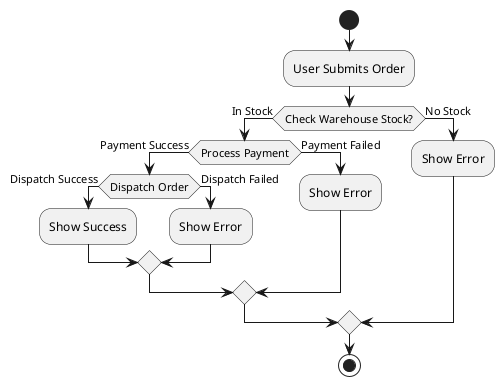


**Mermaid**

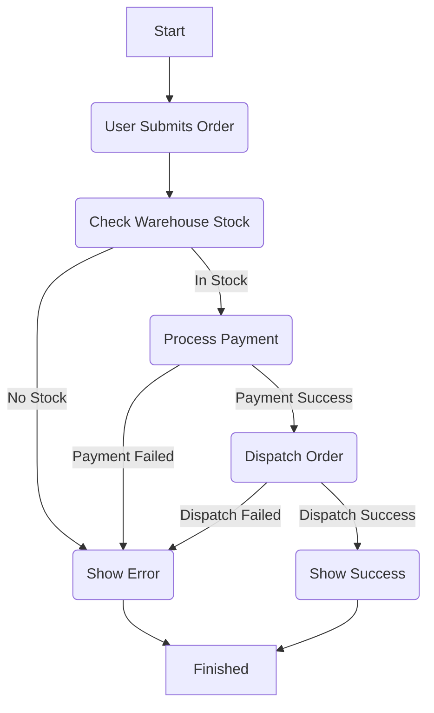


### Sequence Diagram

Sequence diagrams are not as good as Flowcharts for showing branches or loops (although it can be done), but they shine to show actions taken by different participants and the timing of the action execution.

**PlantUML**

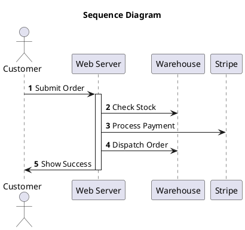


**Mermaid**

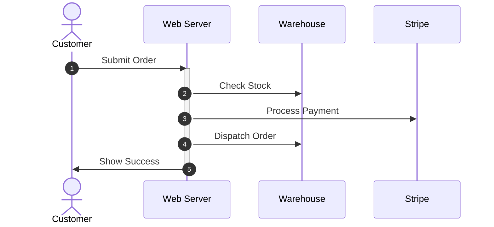


### Entity Relationship Diagram

ER diagrams can be useful to model entities and their relationships between each other. This can simply be the entity names or can also include attributes and their types.

**PlantUML**

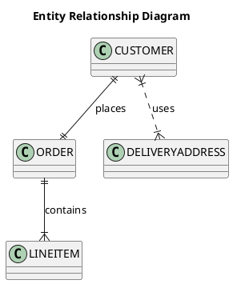


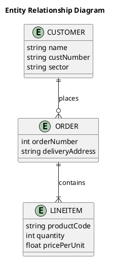


**Mermaid**

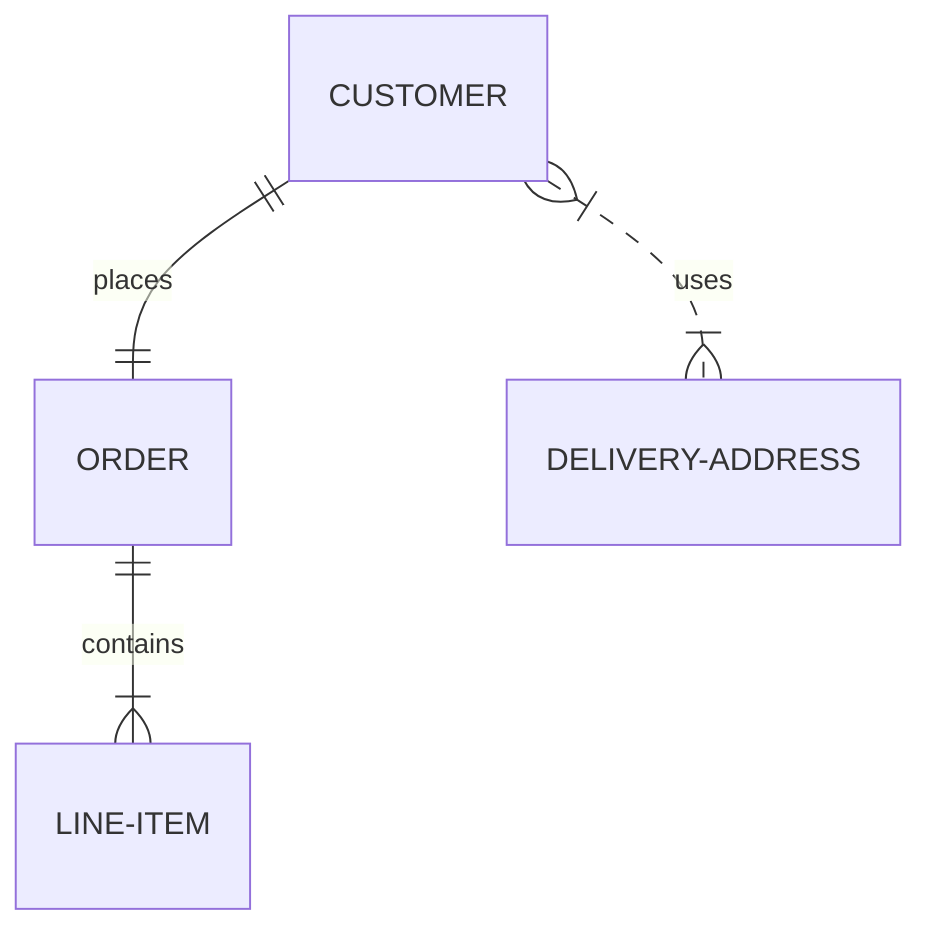


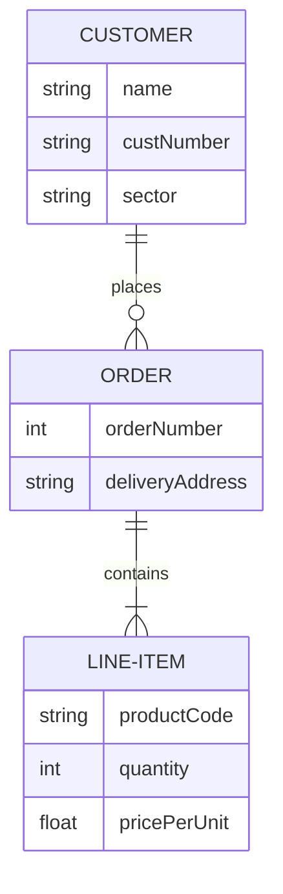


### State Diagram

State diagrams are somewhat similar to flowcharts.  However, where flowcharts are better to show steps and branches, State diagrams are better to show valid transitions for a single value.

**PlantUML**

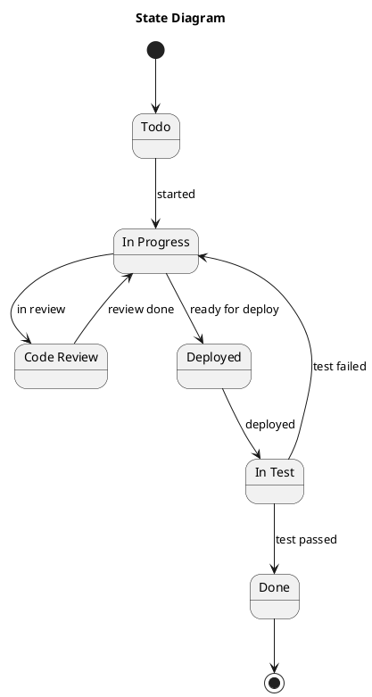


**Mermaid**

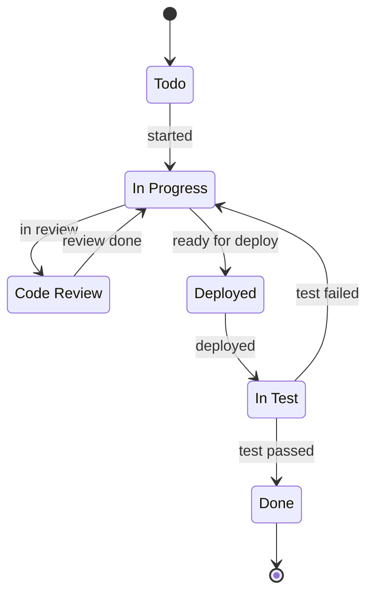


### C4 Models
[C4 Models](https://c4model.com/) are great for showing the architecture of software from a high-level then zooming in to parts of the system for more detail.

**PlantUML**

```plantuml
@startuml

!include https://raw.githubusercontent.com/plantuml-stdlib/C4-PlantUML/master/C4_Context.puml
!include https://raw.githubusercontent.com/plantuml/plantuml-stdlib/master/logos/react.puml

'SHOW_PERSON_PORTRAIT()

title PlantUML C4 Context Diagram

Person(customer, "Customer", "Online Customer")
System(eCommerce, "E-Commerce", "E-Commerce System", $sprite="react")
System_Ext(stripe, "Stripe", "Payments")
System_Ext(warehouse, "Warehouse", "Stock inventory and dispatch")

Rel(customer, eCommerce, "orders products", "HTTPS")
Rel(eCommerce, stripe, "process payment", "HTTPS")
Rel(eCommerce, warehouse, "check stock", "HTTPS")

@enduml
```


**Mermaid**

Mermaid support for C4 is experiemental.  This is evident from the sub-standard diagram below. 😢

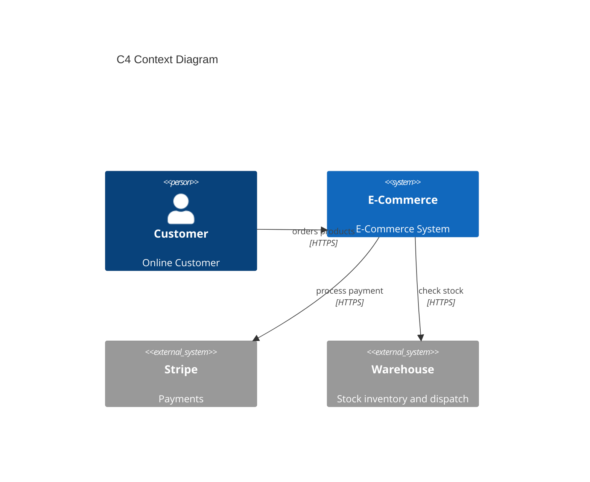


### GitGraph

GitGraph is kind of niche but could come in handy when documenting branching strategies.

**PlantUML**

Not supported.

**Mermaid**

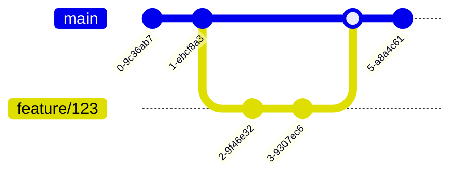


### JSON Data

JSON Data could come in handy when trying to visualize complex JSON structures.

**PlantUML**

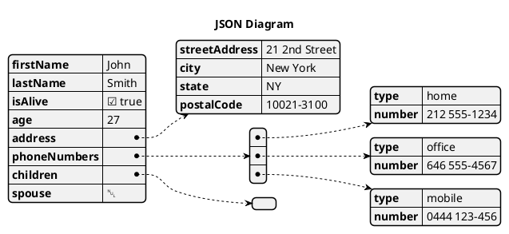


**Mermaid**

Not supported.

### MindMap

MindMap is another niche diagram that you may never need, but nice to know it's available.

**PlantUML**

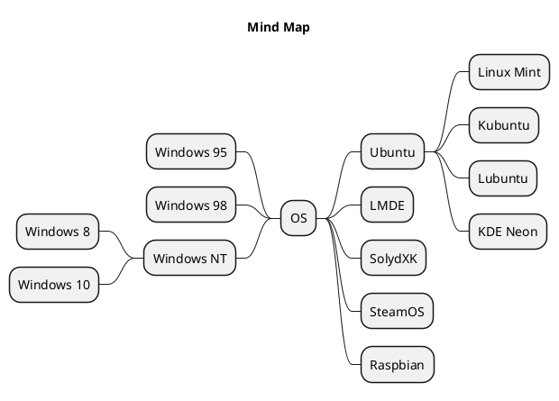


**Mermaid**

Not supported.

## Comparison

Overall, both tools do an excellent job, although in some cases one will shine over the other.

In terms of setup, Mermaid is the simplest as you don't need to set up any external applications or servers. **Winner: Mermaid**.

For Sequence diagrams, both syntax is similar, and the rendered image is also similar. **Winner: Draw**

For ER diagrams, again syntax is similar, but Mermaid renders the images slightly better. **Winner: Mermaid**

For State diagrams, syntax is also similar, but Mermaid renders the images slightly better. Not sure why PlantUML needs to have a line in the middle of each node. **Winner: Mermaid**

For C4 Models, Mermaid support is still experimental. This shows as you have little control over the way the diagram is rendered, and some parts are unreadable (i.e., arrows over nodes). PlantUML works as you would expect and has support for more advanced setup like sprites. Not even close on this one. **Winner: PlantUML**

GitGraph is not supported by PlantUML.  **Winner: Mermaid**

JSON Data is not supported by Mermaid.  **Winner: PlantUML**

MindMap is not supported by Mermaid.  **Winner: PlantUML**

In terms of customisation, PlantUML has been around far longer and supports advanced diagram customisation. Mermaids support is more limited. **Winner: PlantUML.**

The big elephant in the room is the rendering. Having markdown auto render the images in source control systems like Azure DevOps or GitHub is HUGE! This guarantees the diagrams will always be up to date with their definitions. With PlantUML, you need to also check in the images to source control and these could easily become out of date. **Winner: Mermaid**

Overall if I had to pick one, I would choose Mermaid.  The main reason being ease of use directly in markdown.  Mermaid will be fine for most of your needs, but for anything more complex or for doing C4 models, I would fall back to PlantUML. **Overall Winner: Mermaid**

## Summary

In this article we've explored how to setup PlantUML and Mermaid and the main differences between the two.  We've compared the common diagram types such as activity/flowcharts, sequence, entity relationship, state, and C4 models.  We also explored some niche diagrams such as gitgraph, JSON data, and mind maps.

Much of the syntax is similar between the two, but Mermaid tends to do a slightly better job at rendering a nicer looking diagram OOTB. Mermaids' big downfall is the experimental support for C4 models, which is an excellent for architectural diagrams.

As mentioned above Mermaid is the winner IMHO and performs best for most scenarios.  PlantUML is still a great tool and can be used as a fallback where Mermaid falls short.

Hope you've enjoyed exploring the difference between these two tools.  If you a favourite you prefer over both these, please let me know in the comments below.

Examples shown can be found in my [plantuml-vs-mermaid](https://github.com/danielmackay/plantuml-vs-mermaid) GitHub repo.

## References

- [Mermaid Docs](https://github.com/mermaid-js/mermaid)
- [Mermaid Live Editor](https://mermaid.live/)
- [PlantUML Docs](https://plantuml.com/)
